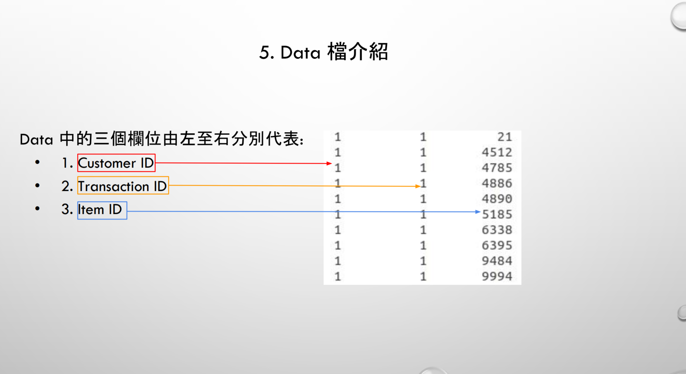
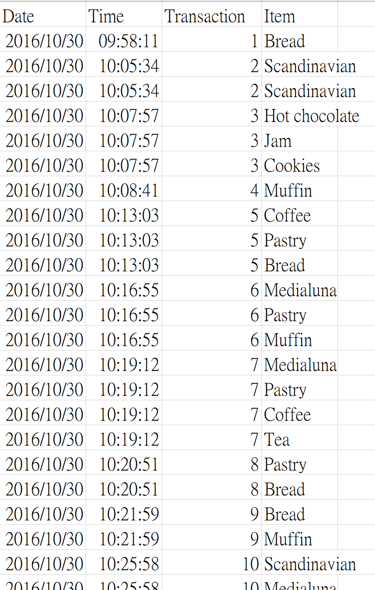
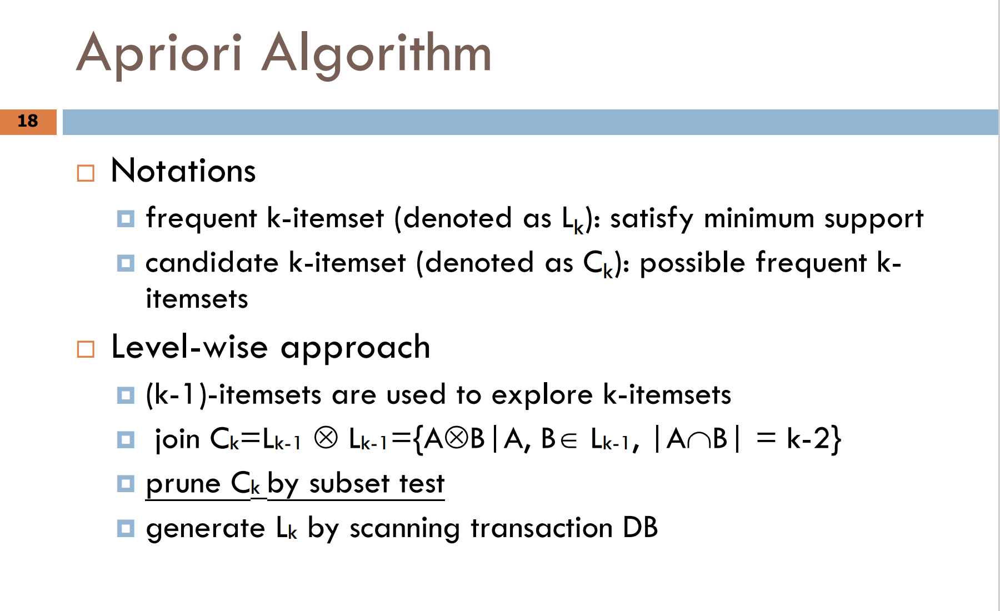
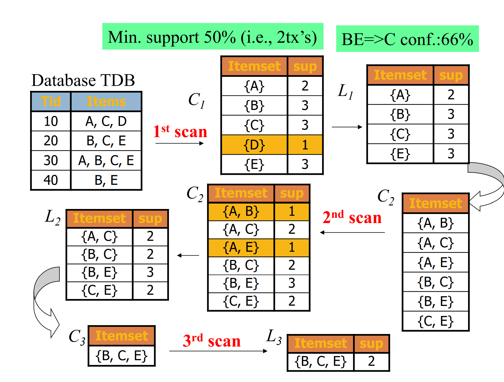
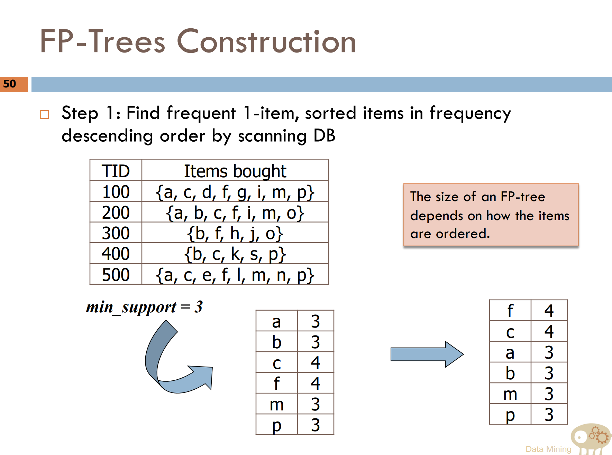
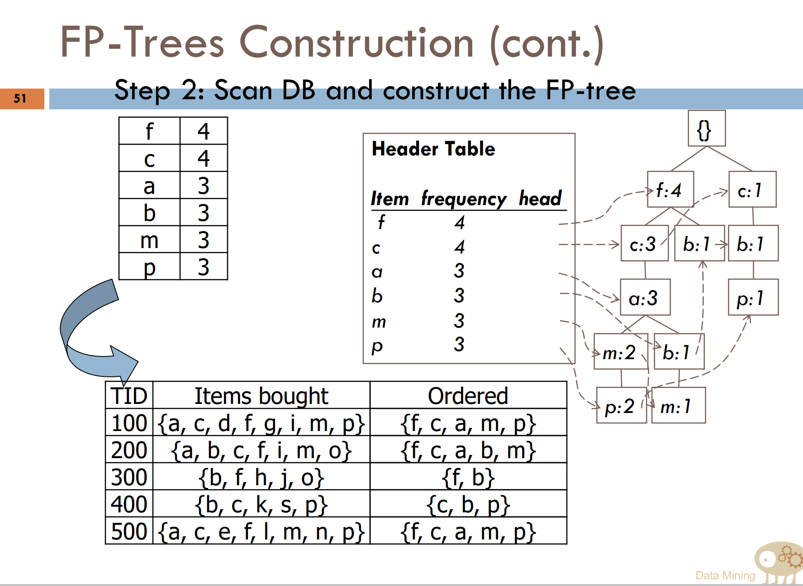
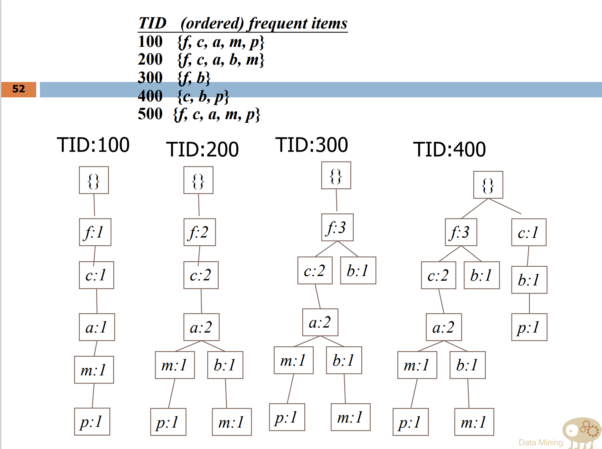
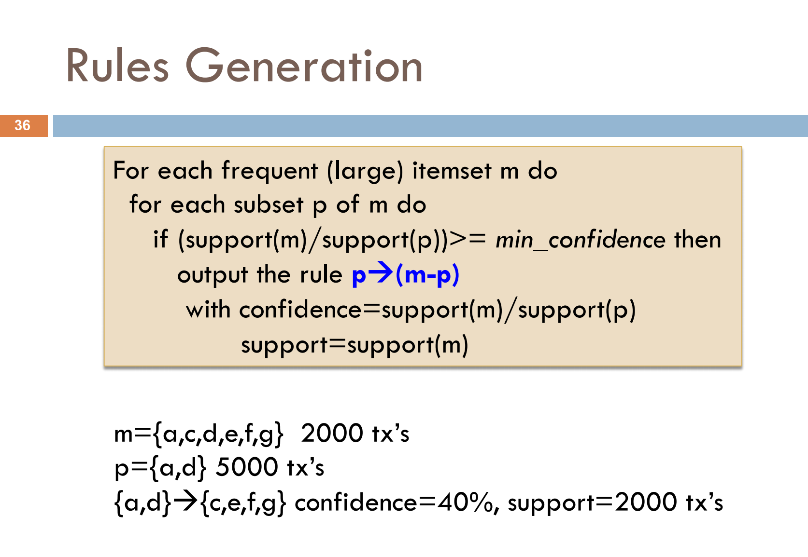

# Association-Rules

The repo contains two association rule algorithms implementation including:
- Apriori
- FP-Growth

## Dataset
### [IBM_Dataset](./test_data.txt)
> Choose TID(Transaction ID) and Item as features running the algorithms

### [Kaggle BreadBasket Dataset](./BreadBasket_DMS.csv)
> Choose TID(Transaction ID) and Item as features running the algorithms

## Contents

---

### Apriori

---

### FP-Growth

---

### Rules Generation

---

## Result ([see here](./Association_Rules.ipynb))
- Get Rules from Data
- Time Comparison
